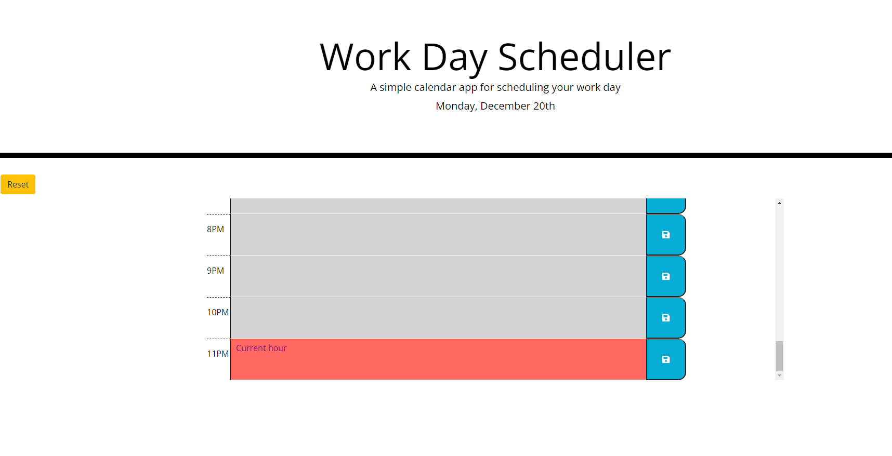

# Work Day Scheduler

In this project I built a simple calendar application that allows the user to save events for each hour of the day. The current day is given at the top of the calendar and the present hour for the day is specified by the timeblock with red color. By clicking the save button the event is saved. The reset button removes the events from the calendar. Local storage was used for saving the events.

Below is a snapshot of the project.

## Instructions

After downloading the app click on index.html to see the calendar app.

## Usage
With this app you can save and remove events for each hour of the current day.

## Tests
This app was tested manually.
